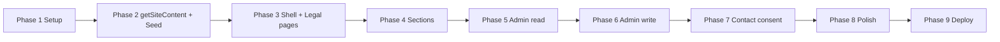

# Build Plan

Dieser Ablauf ist auf **wenig Rework** und **klare Cursor-Sessions** ausgelegt: zuerst Lesepfad und Typen, dann UI immer gegen `SiteContent`, Admin schreibt dieselbe Quelle. Abgestimmt mit `docs/architecture.md`, `AGENTS.md`, `README.md`.

## Prinzipien (kurz)

1. **Kontrakt vor UI** – `types/site-content.ts` + (so früh wie möglich) Zod + **ein** `getSiteContent()` und Seed/Mock-Daten; Sektionen bekommen nur Teilbäume als Props, keinen parallelen Hardcode-Content.
2. **Dünner vertikaler Schnitt** – Eine Sektion (z. B. Hero) end-to-end aus echter Datenquelle validiert das Muster; die übrigen Sektionen folgen als „Kopieren und anpassen“.
3. **Routen- und Link-Stabilität** – `/impressum` und `/datenschutz` früh anlegen (auch mit Platzhaltertext aus Seed), damit Header/Footer nicht auf 404 zeigen.
4. **Admin nach stabilem Read-Pfad** – Öffentliche Seite liest `SiteContent` zuverlässig; erst dann Formulare + Speichern (Server Actions o. Ä.) auf dieselbe Persistenz.
5. **Offene Tech-Entscheidungen** (`tech-decisions.md`) nicht wegstümpern: minimaler **Persistenz-Stub** (z. B. JSON-Datei im Repo oder Konstante) bis Storage/Auth geklärt sind; Entscheidung kurz dokumentieren.

---

## Phase 1 – Projekt-Setup & Routing-Gerüst

- Next.js (App Router) initialisieren, TypeScript, Tailwind, shadcn/ui
- Route Groups wie in `docs/architecture.md`: `app/(public)/`, `app/(admin)/admin/…`, `app/api/`
- `components/`, `lib/`, globale Styles, Basis-Layout
- **Optional aber empfohlen in derselben Phase:** `.env.example` mit Platzhaltern für später (Kontakt, Revalidate-Secret)

## Phase 2 – SiteContent-Lesepfad (kein Admin-Schreiben)

- `getSiteContent()` (Server-only) + **eine** Quelle: Seed-JSON oder eingecheckte Datei, bis Storage feststeht
- Sortierung/Validierung wo nötig (z. B. Kurse nach `sortOrder`, Regeln aus `content-model.md`)
- Öffentliche **Metadata** aus `settings` vorbereiten (`siteTitle`, `metaDescription`, …)

*Cursor-Tipp: Eine Session „Datenschicht + Seed“; danach können UI-Sessions immer `getSiteContent` importieren.*

## Phase 3 – Public Shell & statische Nebenrouten

- `SiteHeader` / Mobile-Nav, `SiteFooter` (Legal-Links)
- One-Pager-Gerüst: Sektionen mit **Anker-IDs** aus `content-model.md` (`#hero`, `#aktuelles`, `#kurse`, …); **Kurz-„Über mich“-Teaser** unter dem Hero ohne eigene Anker-ID (siehe `content-model.md`)
- **Seiten** `/impressum`, `/datenschutz` – Inhalt aus `legal.*` des Seeds (Platzhalter ok)
- Basis-Responsive-Verhalten

## Phase 4 – Public Sektionen (an `SiteContent` gekoppelt)

- **Zuerst ein vertikaler Schnitt:** z. B. `HeroSection` voll aus `SiteContent.hero` + `settings`
- Danach: `AboutTeaserSection` (Kurzportrait unter dem Hero, statischer Text; inhaltlich an `about` halten), `AktuellesSection`, `CoursesSection`, `PricesSection`, `AboutSection`, `ContactSection` – Props aus `SiteContent` wo vorgesehen (Teaser aktuell Ausnahme, siehe `content-model.md`)
- Domain-Komponenten (`CourseCard`, `PriceCard`, …) gemäß `component-map.md`
- Kontakt-Sektion: UI + Validierung clientseitig möglich; **Submit** kann vorerst stubben bis Phase 6

*Hinweis: Die alte Trennung „erst Sektionen bauen, dann SiteContent anbinden“ entfällt – vermeidet doppelte Implementierung.*

## Phase 5 – Admin Foundation & Lesen

- Admin-Layout, Navigation, Überblick
- **Read-only** Anzeige des aktuellen `SiteContent` (oder pro Bereich) – bestätigt, dass Admin und Public dieselbe Quelle sehen
- Routenstruktur (Tabs oder Unterrouten) wie in `admin-scope.md` / `docs/architecture.md`

## Phase 6 – Admin Editing & Persistenz

- Formulare (React Hook Form + Zod, gleiche Regeln wie Public-Validierung)
- Speichern per Server Actions (oder geschützte API) → **dieselbe** Persistenz wie `getSiteContent`
- Bereiche schrittweise: Kurse, Preise, Hero/About/Settings, Legal (siehe `admin-scope.md`)
- **`POST /api/revalidate`** (o. Ä.), wenn ISR/On-Demand Revalidation genutzt wird
- **Auth für `/admin`** wenn entschieden (`tech-decisions.md`); bis dahin: nur lokal, Vercel Protection oder Basic Auth – in README/Specs kurz festhalten

## Phase 7 – Kontakt-Backend, Consent, Rechtliches live

- `POST /api/contact` gemäß `legal-and-forms.md` / `tech-decisions.md` (Provider wählen, Env dokumentieren)
- Cookie-Banner / Consent nur wenn Anforderung und Umsetzung geklärt
- Impressum/Datenschutz-Inhalte über Admin pflegbar (falls noch Platzhalter)

## Phase 8 – Polish

- Accessibility, Responsive-Feinschliff, Loading/Empty States, UI-Politur
- Abgleich mit `design-reference/design-system-profile.json`

## Phase 9 – Deployment

- GitHub, Vercel, Domain-Verknüpfung, Handoff (Env-Liste in README ergänzen)

---

## Mapping: Alt → Neu

| Vorher | Nachher |
|--------|---------|
| Phase 2 Shell, Phase 3 Sektionen, Phase 4 SiteContent | Phase 3 Shell + Legal-Routen, Phase 2+4 Lesepfad und Sektionen direkt an `SiteContent` |
| Phase 5–6 Admin nacheinander ohne expliziten Read-Schritt | Phase 5 Read-only Admin, Phase 6 Schreiben + Revalidate |
| Phase 7 Contact/Legal spät | Legal-**Routen** in Phase 3; Backend/Consent in Phase 7 |

---

## Abhängigkeiten (für die Reihenfolge in Cursor)

Optional parallel zu Phase 4–6: Design-Tokens feinjustieren, solange die Props-Schnittstellen der Sektionen stabil bleiben.
